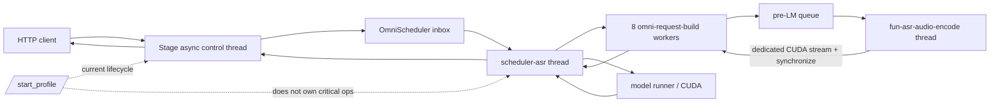

# CPU Saturation and Host-Dispatch Profiling Plan

Status: **Conditional — execution-ready instrumentation plan; root cause unverified**

Revision: 1

Target branch: `debug/problem`

Baseline: `fe3f2c59892d5ed5c7184db94cfd1b836c1d3073` (`upstream/main`,
2026-08-04)

Primary reproduction: Fun-ASR Nano on a direct, single SGLang-Omni server.
The router becomes a controlled comparison only after the direct-server
mechanism is understood.

## 1. Decision summary

The evidence in issue
[#1296](https://github.com/sgl-project/sglang-omni/issues/1296) and its
[CPU-affinity experiment](https://github.com/sgl-project/sglang-omni/issues/1296#issuecomment-5173754355)
proves that shared-host interference can reduce throughput and that a cpuset can
recover much of it. It does **not** prove that all-core frequency reduction is
the primary mechanism.

`taskset` plus moving load away from the server changes several variables at
once:

- runnable delay, preemption, migrations, and context switching;
- SMT sibling contention;
- core and last-level cache residency;
- NUMA placement and memory bandwidth;
- package power, turbo residency, temperature, and actual core frequency.

Low aggregate CPU PSI also does not exclude delays on the scheduler,
request-builder, or encoder worker threads. Linux system-level CPU `full` PSI
is undefined and reports zero; `some` must be interpreted using its exact
`total` delta and the relevant system or cgroup scope.

The proposed cpuset in PR #1321 is therefore useful as a CI noise control and
operational mitigation, not yet as a root-cause repair. No encoder,
scheduler, router, or compiler optimization should be selected until the
measurement plan below separates:

1. frequency/power effects;
2. SMT, cache, and NUMA interference;
3. runnable-to-running scheduler delay;
4. extra host work per request;
5. a serial host-dispatch stage that starves the GPU;
6. actual application queueing.

The minimum evidence needed before selecting a code fix is:

- a repeated, unprofiled baseline;
- one request-correlated CPU/CUDA timeline;
- `perf stat` counts and actual-frequency telemetry from separate low-overhead
  runs;
- scheduler-delay evidence for the critical TIDs;
- a pinning × SMT-sibling × NUMA experiment;
- direct-server versus router A/B only after the direct-server result is
  stable.

## 2. What is known and what remains a hypothesis

### Established observations

- In the reported synthetic-load experiment, an unpinned DP2 service retained
  roughly 55–62% of its quiet throughput, while isolating the server cores
  recovered roughly 92%.
- The same experiment reported about 46–47 CPU-ms/request when quiet and
  72–83 CPU-ms/request under unpinned load.
- The historical 128–139 request/s result was not reproduced by the quiet
  baseline in that comment, which reached roughly 91–94 request/s. The
  experiment explains sensitivity relative to its own quiet baseline, but not
  the entire historical regression.
- Current Fun-ASR request construction, pre-LM encoding, scheduling, and model
  execution are spread across independent user-created threads.
- The existing `/start_profile` handler starts `TorchProfiler` on the stage
  async control thread. The critical model work runs on `scheduler-asr`, eight
  `omni-request-build_*` workers, and `fun-asr-audio-encode`.
- `TorchProfiler.step()` exists but has no call site, and the current profiler
  records continuously between fire-and-forget start and stop messages.
- The coordinator returns from stop before stage acknowledgement, trace
  finalization, or background gzip completion.
- The common benchmark runner warms requests sequentially, not at the target
  concurrency and batching distribution.

### Unverified architectural hypotheses

These are investigation targets, not proposed fixes:

- **H1 — DVFS/package-power:** actual busy MHz falls under all-core load while
  instructions/request, IPC, and scheduler delay remain stable.
- **H2 — SMT/cache interference:** work on a server core's sibling reduces IPC
  or increases backend/cache stalls even at comparable actual frequency.
- **H3 — scheduler delay:** one or more critical TIDs spend more time runnable
  but not running; aggregate PSI hides the local effect.
- **H4 — extra work:** instructions/request or call counts grow under
  interference, explaining the CPU-time increase independently of frequency.
- **H5 — serial host-dispatch critical path:** request build, pre-LM service, or
  scheduler/model launch is a serial limiter, so small GPU workloads expose GPU
  feed gaps.
- **H6 — application queueing:** offered load exceeds service capacity and
  queue wait grows while in-service phase cost stays stable.
- **H7 — request-build completion ordering:** `_drain_request_build_results()`
  checks the first inserted future and returns if it is incomplete. Mixed
  request-build durations may cause completed later futures to wait behind the
  first one.
- **H8 — router amplification:** routing or multi-worker coordination adds a
  separate bottleneck. This cannot be inferred from a router-only benchmark.

## 3. Current mechanics and ownership

### Fun-ASR execution path



The main symbols are:

- `FunASRPipelineConfig` in `sglang_omni/models/fun_asr/config.py`;
- `create_sglang_fun_asr_executor` in
  `sglang_omni/models/fun_asr/stages.py`;
- request construction in `sglang_omni/models/fun_asr/request_builders.py`;
- `FunASRPreLMEncoderService` in
  `sglang_omni/models/fun_asr/encoder_service.py`;
- shared `PreLMEncoderService` in
  `sglang_omni/scheduling/pre_lm_encoder.py`;
- `OmniScheduler` in `sglang_omni/scheduling/omni_scheduler.py`;
- stage and profiler control in `sglang_omni/pipeline/stage/runtime.py`.

### Important current contracts

- The request-builder interval currently includes audio load/feature
  extraction, tokenization, and a blocking wait on the pre-LM encoder future.
  Its existing start/end events cannot distinguish those phases.
- The pre-LM encoder batches up to eight items, waits up to four milliseconds,
  runs on a dedicated CUDA stream, clones output partitions, synchronizes the
  stream, and caches embeddings on CPU.
- The scheduler owns admission, request-builder staging/draining, batch
  selection, async decode resolution, and result processing.
- CPU percentages attributed to these components are not critical-path
  percentages because the phases overlap.
- The direct benchmark endpoint already exists; the managed CI test happens to
  use a router and two workers. The router is not required to reproduce the
  model server path.

### Existing profiler gaps

1. **Thread ownership:** PyTorch profiler contexts are thread-sensitive for
   user ranges. Starting on the stage control thread is not a reliable capture
   of independent scheduler, request-builder, and encoder threads.
2. **No bounded schedule:** there is no skip/wait/warmup/active schedule and no
   semantic call to `step()`.
3. **No readiness protocol:** start and stop use one-way push sockets. A
   successful HTTP response does not mean all target processes are active or
   that artifacts are durable.
4. **Insufficient phase identity:** current events cannot isolate queue wait,
   feature extraction, encoder service, scheduler work, or GPU feed gaps.
5. **Uncontrolled perturbation:** a continuous CPU+CUDA trace can be large and
   intrusive. Profiler overhead is not qualified against an unprofiled run.
6. **Artifact race:** gzip is launched asynchronously and has no completion
   acknowledgement.
7. **Latent idempotency bug:** the same-run early return in
   `TorchProfiler.start()` references `rank` before it is assigned.
8. **Unused API data:** `StartReq.config` is accepted and passed to
   `broadcast_start()`, but is not serialized into `ProfilerStartMessage`.
   The route also exposes no stage or owner selection.

Historical commits `674dd35b` and `7e18687e` attempted and then reverted
scheduler-thread profiler ownership without recording a revert rationale.
Later experiments (`77aab9bf`, `ac378092`, and `d74a6891`) appended manual
cross-thread events to a torch trace and had to add clock alignment. They are
useful evidence, but manual Chrome-trace surgery is not the selected design:
clock domains, dropped events, and concurrent writers make it too easy to
produce a plausible but incorrect joint trace.

## 4. Selected measurement architecture

Use three complementary layers. No one layer is allowed to answer a question
it cannot observe.

### Layer A — stable, request-correlated semantic events

Extend the existing JSONL event recorder with coarse phase boundaries and
numeric metadata. It is the cross-thread source of truth for request identity,
queueing, batching, and high-level critical-path reconstruction.

Requirements:

- events use the existing monotonic timestamp source;
- stable request IDs are fields, never embedded in range names;
- events include `run_id`, stage, PID, native TID, and thread name;
- batch events include a stable batch ID, batch size, request IDs or a bounded
  mapping record, phase type, input-duration bucket, and token count;
- range names are static and low cardinality;
- instrumentation is a no-op when inactive;
- frequent sub-microsecond functions are not annotated;
- each producer records dropped-event counts and flush status.

### Layer B — bounded PyTorch operator attribution

Run one PyTorch profiler owner per process and per experiment. For the first
Fun-ASR pass, the owner is `scheduler-asr`, because it owns SGLang scheduling
and model-runner launch work.

Do not start concurrent PyTorch profilers on the scheduler, request builders,
and encoder worker. Do not describe one control-thread trace as a process-wide
CPU trace.

The scheduler-owner capture must:

- be installed and removed at a scheduler-thread safe point;
- use `ProfilerActivity.CPU` and `ProfilerActivity.CUDA`;
- default `record_shapes`, `with_stack`, `profile_memory`, and `with_flops` to
  false;
- use an internal schedule such as `wait=1, warmup=1, active=20` scheduler
  steps after the external workload is already stable;
- call `TorchProfiler.step()` once after a completed scheduler batch/model
  iteration and record the batch kind and size alongside the step;
- auto-stop after the active window, then export and finalize before reporting
  completion;
- run a second, shorter focused pass with shapes or stacks only if the first
  pass names an unresolved operator family;
- report profiled versus unprofiled throughput. A trace with more than 5%
  perturbation is attribution evidence only and cannot supply performance
  totals.

Request-builder and encoder detail comes from semantic events and a separate
Nsight trace. If operator attribution inside the encoder is still necessary,
add a mutually exclusive `pre_lm_encoder` profiler-owner mode and run it in a
separate process restart.

### Layer C — joint system/CUDA evidence

Use Nsight Systems in a separate run, with opt-in NVTX ranges carrying the same
static phase names and a run-window marker. Capture CUDA API, kernels, OS
runtime/thread scheduling, and NVTX for only the active window. The event
manifest provides request/batch correlation.

Do not co-run Nsight Systems and PyTorch profiler unless a dedicated
perturbation check shows that the joint capture is usable.

Collect Linux system evidence in additional low-overhead runs:

- `perf stat` for the server process or cgroup: `task-clock`, `cycles`,
  `ref-cycles`, `instructions`, context switches, CPU migrations, and faults;
- a separate `perf stat` pass for cache/stall events to avoid excessive PMU
  multiplexing;
- `perf sched timehist` for the scheduler, active request-builder, and encoder
  native TIDs, reporting runnable-to-running delay and run time;
- exact `/proc/pressure/cpu`, `/proc/pressure/memory`, and
  `/proc/pressure/io` `total` deltas at system and applicable cgroup scopes;
- `turbostat` (`Bzy_MHz`, busy percentage, package power, temperature, and
  throttle counters) or the architecture-equivalent tool;
- `numastat -p`, `/proc/<pid>/numa_maps`, CPU topology, IRQ/softirq placement,
  and memory-bandwidth counters when available.

`scaling_cur_freq` is not accepted as proof of actual frequency: on many
drivers it reports the last requested performance state rather than measured
busy frequency.

## 5. Planned code changes

All changes are opt-in. Normal serving behavior and endpoint defaults remain
compatible.

### Phase 1 — profiler lifecycle and artifact integrity

Modify:

- `sglang_omni/proto/messages.py`
- `sglang_omni/profiler/profiler_control.py`
- `sglang_omni/profiler/torch_profiler.py`
- `sglang_omni/pipeline/stage/runtime.py`
- `sglang_omni/serve/launcher.py`
- `sglang_omni/scheduling/omni_scheduler.py`

Add:

- `sglang_omni/scheduling/profiler_control.py`
- `tests/unit_test/profiler/test_profiler_control.py`
- `tests/unit_test/profiler/test_torch_profiler_schedule.py`
- `tests/unit_test/profiler/test_profiler_routes.py`

Implement:

1. Extend start configuration with:
   - `stages`;
   - `torch_owner` (`scheduler` initially; later
     `pre_lm_encoder` as a conditional extension);
   - schedule parameters with bounded maximums;
   - activity and expensive-feature flags;
   - artifact directory and optional NVTX/event-only modes.
2. Add an operation ID distinct from `run_id`. Every target reports
   `accepted`, `active`, `stopped`, `exported`, `flushed`, or `failed`, with
   PID, rank, stage, owner TID, artifact paths, and error text.
3. Route profiler lifecycle commands through the scheduler inbox and execute
   them on the scheduler thread. TP ranks must agree on the transition; a
   partial start fails the operation instead of returning a partial trace as
   success.
4. Make start idempotent for the same run/config and reject conflicting active
   runs. Fix the pre-assignment `rank` access.
5. Make stop wait for torch export and event flush. Compression may be
   synchronous after the active window or awaited as a managed worker, but
   `exported=true` must identify a readable final artifact.
6. Return a structured manifest from the coordinator only after all selected
   targets acknowledge. Bound all waits and retain per-target failure state.
7. Preserve the existing endpoints. Existing clients that omit new fields get
   bounded safe defaults; wildcard stop remains available for operator
   recovery but must report what it stopped.
8. Add a trace-integrity check that opens every gzip/JSONL file and verifies:
   expected PID/TID metadata, the scheduler-owner canary, at least one active
   step, CUDA activity when requested, event counts, and no unreported target.

### Phase 2 — semantic phase instrumentation

Modify:

- `sglang_omni/profiler/event_recorder.py`
- `sglang_omni/scheduling/omni_scheduler.py`
- `sglang_omni/scheduling/pre_lm_encoder.py`
- `sglang_omni/models/fun_asr/request_builders.py`
- `sglang_omni/models/fun_asr/encoder_service.py`

Add:

- `sglang_omni/profiler/trace_ranges.py`
- `tests/unit_test/profiler/test_trace_ranges.py`
- `tests/unit_test/fun_asr/test_profiling_events.py`

Add the following coarse events/ranges:

| Owner | Range/event | Required metadata |
|---|---|---|
| request builder | `request_build.audio_load` | request, input bytes/duration, cache source |
| request builder | `request_build.feature_extract` | request, frames, output shape bucket |
| request builder | `request_build.tokenize_and_pack` | request, prompt/audio token counts |
| request builder | `request_build.pre_lm_wait` | request, encoder queue entry ID |
| pre-LM service | `pre_lm.enqueue` / `dequeue` | entry, request, queue depth, wait time |
| pre-LM service | `pre_lm.batch` | batch ID/size, duration bucket, cache misses |
| pre-LM service | `pre_lm.encode` | batch, item/token count |
| pre-LM service | `pre_lm.synchronize` | batch, stream/device |
| scheduler | `scheduler.recv_and_admit` | received/deferred/backlog/pending counts |
| scheduler | `scheduler.drain_builds` | inspected/ready/HOL-blocked counts |
| scheduler | `scheduler.select_batch` | type, running/waiting, batch size |
| scheduler | `scheduler.model_execute` | type, batch ID, token counts |
| scheduler | `scheduler.result_process` | batch ID, emitted/completed counts |

Extend `QueueEntry` with profiling identity rather than deriving identity from
the multimodal payload. Preserve this identity through retries.

For H7, record both the number of completed futures and whether draining stops
on an incomplete first future. Do not change completion ordering in the
profiling patch. A separate bounded A/B may implement ready-future draining
only if traces show material head-of-line delay.

The range helper must be an allocation-light no-op when inactive. NVTX is
enabled explicitly for Nsight runs; the JSONL recorder remains the source of
request identity and exact duration metadata.

### Phase 3 — reproducible profiling harness

Add:

- `benchmarks/profiling/profile_cpu_saturation.py`
- `benchmarks/profiling/system_collectors.py`
- `benchmarks/profiling/README.md`
- `tests/unit_test/benchmarks/test_profile_cpu_saturation.py`
- `tests/unit_test/benchmarks/test_system_collectors.py`

The harness must:

1. Target a direct server URL first. It must not start or require the router.
2. Store a run manifest containing:
   - git SHA and dirty state;
   - model repository and immutable revision;
   - PyTorch, SGLang, CUDA, driver, kernel, and firmware versions;
   - full server command and relevant environment;
   - CPU/core/socket/NUMA/SMT topology and GPU NUMA locality;
   - governor, min/max policy, boost, cgroup quota/cpuset;
   - OMP, MKL, OpenBLAS, and PyTorch thread settings;
   - corpus hash, order, audio-duration/token buckets, concurrency, and arrival
     model;
   - ambient processes, JIT/cache state, and system collector availability.
3. Warm all duration/shape buckets at the target concurrency and batching
   regime. Sequential warmup from `BenchmarkRunner._warmup()` is insufficient.
4. Continue warmup until rolling completed QPS, p50 latency, and CPU-ms/request
   stay within a configurable 3–5% band for multiple windows. Lazy compilation,
   autotune, CUDA graph capture, allocator growth, and caches must settle.
5. Run an unprofiled baseline before profiling. Use at least five fresh server
   restarts per condition, randomized/interleaved A/B/B/A ordering, and report
   median, dispersion, and bootstrap confidence intervals.
6. Support:
   - closed-loop concurrency sweeps for regression comparability;
   - open-loop offered-rate sweeps to distinguish service capacity from
     client feedback;
   - fixed corpus replay with output validation.
7. Record offered, accepted, completed, failed, and timed-out requests; p50,
   p95, and p99 latency; server queue phase times; CPU-ms/request by PID/TID;
   and GPU busy/feed gaps.
8. Arm a bounded semantic capture only after stability. Keep traffic running
   until the server reports the trace window exported.
9. Run torch, Nsight, `perf stat`, `perf sched`, and detailed PMU collection as
   separate experiment modes by default.
10. Validate the manifest and all artifacts before marking a run complete.

The standalone ASR Seed-TTS benchmark can remain the correctness/reference
client, but the profiling harness owns warmup, rate generation, restarts,
randomization, system collection, and artifact validation.

## 6. Experiment protocol

### Stage 0 — correctness and quiet baseline

- Start one Fun-ASR server:

  ```bash
  sgl-omni serve \
    --model-path FunAudioLLM/Fun-ASR-Nano-2512-hf \
    --host 127.0.0.1 \
    --port 8000
  ```

- Pin only after recording the machine's physical-core, SMT-sibling, socket,
  NUMA, IRQ, and GPU topology. Never paste a cpuset from another host.
- Use a fixed, checksummed corpus spanning the input-duration and output-token
  distribution used by issue #1296.
- Verify transcript/result parity and 100% completion before collecting
  performance evidence.
- Measure quiet, unprofiled single-server throughput at concurrency levels
  around saturation. Include an open-loop rate sweep.

### Stage 1 — low-overhead attribution

- Collect request-correlated semantic events without torch or Nsight.
- Run `perf stat` and actual-frequency telemetry in separate repetitions.
- Calculate per-request instructions, cycles, reference cycles, task-clock,
  context switches, migrations, and phase time.
- Collect scheduler delay for the critical native TIDs.
- Only after confirming the effect is reproducible, capture the bounded
  scheduler-owner torch trace and a separate Nsight Systems trace.

### Stage 2 — mechanism-isolating factorial

Use the same corpus, traffic pattern, server settings, and measurement windows:

| Condition | Server placement | Interferer placement | Question |
|---|---|---|---|
| A | unpinned | none | quiet reference |
| B | physical cores pinned | none | pinning-only effect |
| C | unpinned | compute loops | reproduce shared-load loss |
| D | pinned | server SMT siblings | isolate sibling contention |
| E | pinned, siblings idle | other physical cores, same socket | isolate package/cache effects |
| F | pinned, siblings idle | other socket/NUMA node | isolate socket/NUMA effects |
| G | pinned, siblings idle | memory-bandwidth load | test memory/cache pressure |
| H | one logical CPU/core or SMT disabled | matched load | validate SMT mechanism |
| I | controlled governor/boost if operationally safe | matched load | validate frequency causality |
| J | fixed CPU/NUMA memory binding | matched load | validate NUMA placement |
| K | PyTorch/OMP/MKL thread-pool sweep | none and matched load | detect oversubscription |

Match the interferer's useful work, placement, and duration. Record its own
CPU allocation and counters. Two repetitions are not sufficient.

### Stage 3 — router control

Only after the direct server has a stable result:

- run the identical client, corpus, rate, and model/server count through the
  router;
- keep worker placement and system state unchanged;
- attribute added queueing and CPU cost to router/coordinator processes;
- do not mix a DP2 direct-server result with a DP3 router result.

### Stage 4 — model-family transfer

Repeat only the decisive conditions on:

- Qwen3-ASR as the reported ASR comparison;
- one small TTS model with host-dispatch-heavy per-token/per-frame work.

The transfer test asks whether the mechanism scales with small GPU work and
frequent host dispatch. It is not a full model × topology Cartesian sweep.

## 7. Root-cause decision table

| Mechanism | Evidence required | Evidence that rejects it |
|---|---|---|
| DVFS/package power | instructions/request and IPC stable; actual `Bzy_MHz` drop predicts cycles/wall time; scheduler delay negligible; controlled frequency reproduces/removes gap | instructions/request, IPC, or runnable delay changes materially; throughput does not track actual frequency |
| SMT/cache contention | sibling-only load hurts at comparable actual MHz; IPC falls or stalls/cache misses rise; sibling isolation recovers | no sibling-placement sensitivity and stable IPC/cache metrics |
| Scheduler starvation | critical TID runnable-to-running delay, preemption, migrations, or context switches grow with loss | scheduler delay remains negligible in the degrading window |
| NUMA/memory pressure | CPU/memory binding or interferer socket changes result; remote access/bandwidth counters agree | placement and memory load do not change result |
| Extra host work | instructions/request or semantic call/batch counts rise for identical inputs | instructions and call counts remain stable |
| Serial host-dispatch path | isolated/frequency-controlled trace still shows a serial CPU phase followed by GPU idle/feed gaps; phase duration predicts throughput | GPU remains continuously supplied or the phase is not on the critical path |
| Application queueing | offered rate exceeds completion, queue wait grows, in-service phase time stays stable | phase service time grows before queue wait or under sub-saturation open-loop load |
| Request-build HOL | completed later futures wait behind an incomplete first future and the delay is material; ready-drain A/B removes only that wait | no completed future is held materially or A/B does not affect service |
| Router bottleneck | router A/B adds process CPU/queue time with identical workers and placement | direct and routed runs have equivalent critical path |

A code repair is authorized only when one row has positive evidence and its
principal alternatives have the named rejection evidence. Multiple mechanisms
may be true; report their independent contribution rather than naming one
winner by intuition.

## 8. Validation and acceptance gates

### Instrumentation correctness

- Unit tests prove start/stop idempotency, conflicting-run rejection,
  per-target acknowledgement, timeout/failure reporting, owner-thread
  execution, schedule stepping, and artifact finalization.
- The trace-integrity checker finds the scheduler-owner canary, active steps,
  expected CUDA activity, and matching event run IDs.
- A stopped run has no late writes and no orphan gzip process.
- Event identity survives encoder batching, retries, request aborts, and
  out-of-order request-builder completion.
- Profiler-off instrumentation overhead is statistically indistinguishable
  from baseline and no more than 1% at saturation. Event-only overhead must be
  measured and targeted below 2%.

### Serving correctness

- All baseline and profiled requests complete or have accounted errors.
- Fun-ASR transcripts match the unprofiled reference for the fixed corpus.
- Streaming event order, finalization, and abort behavior are unchanged.
- Batch composition metadata agrees with scheduler and encoder counters.

### Measurement quality

- Quiet baselines are stable across at least five restarts; instability greater
  than the configured 3–5% band blocks causal claims.
- Each profile mode reports its throughput/latency perturbation relative to an
  adjacent unprofiled run.
- PMU multiplexing percentages and unsupported events are present in the
  manifest; heavily multiplexed runs are not used for precise ratios.
- PSI claims name `some`/`full`, average window, exact `total` delta, and
  system/cgroup scope.
- Frequency claims use actual-frequency telemetry, not only cpufreq policy
  files.
- Results include per-run values and dispersion, not only percentages derived
  from two means.

### Repair gate

The investigation may conclude one of:

1. **environmental mechanism:** retain cpuset/topology controls and document
   capacity, but do not present them as an application repair;
2. **runtime architectural mechanism:** implement the smallest owner-correct
   scheduler/request-builder/encoder change and rerun the same proof matrix;
3. **combined mechanism:** quantify the independent environmental and runtime
   contributions and ship separate mitigation and repair changes;
4. **inconclusive:** preserve artifacts and narrow the next experiment instead
   of merging a speculative optimization.

Any repair must pass output parity, direct-server throughput, tail latency,
router A/B, and the decisive interference condition. A quiet-host improvement
alone is insufficient.

## 9. Evidence ledger

| Evidence | Confidence | Consequence |
|---|---|---|
| Issue #1296 history and exact linked experiment | High for reported observations; low for DVFS causality | reproduce measurements, do not inherit conclusion |
| Current main execution path and thread creation | High | profiler ownership and cross-thread correlation are first-order requirements |
| Current profiler start/stop and unused `step()` | High | implement bounded owner-thread lifecycle before trusting torch traces |
| Current sequential benchmark warmup | High | profiling harness must warm target shapes and concurrency |
| Ordered request-build future drain | High as code fact; unknown impact | instrument before changing |
| Historical scheduler-thread profiler attempt/revert | High as repository history; reason unknown | reuse the lesson, not the patch |
| PyTorch profiler thread/schedule guidance | High, official documentation | one owner per capture, explicit warmup/active steps, expensive flags opt-in |
| Linux PSI and cpufreq semantics | High, kernel documentation | exact PSI scope/delta and measured busy frequency required |
| `perf sched` runnable-delay semantics | High, tool documentation | use it to test scheduler starvation directly |
| Nsight Systems NVTX/OS runtime guidance | High, NVIDIA documentation | use a bounded separate joint trace |

## 10. References

- [PyTorch profiler API and schedule](https://docs.pytorch.org/docs/main/profiler)
- [PyTorch profiler recipe](https://docs.pytorch.org/tutorials/recipes/recipes/profiler_recipe.html)
- [PyTorch benchmark utilities and warmup guidance](https://docs.pytorch.org/docs/stable/benchmark_utils.html)
- [PyTorch multiprocessing and CPU oversubscription](https://docs.pytorch.org/docs/stable/notes/multiprocessing.html)
- [Linux Pressure Stall Information](https://docs.kernel.org/6.10/accounting/psi.html)
- [Linux CPU frequency and `scaling_cur_freq` semantics](https://docs.kernel.org/6.17/admin-guide/pm/cpufreq.html)
- [`perf stat`](https://www.man7.org/linux/man-pages/man1/perf-stat.1.html)
- [`perf sched timehist`](https://man7.org/linux/man-pages/man1/perf-sched.1.html)
- [NVIDIA Nsight Systems User Guide](https://docs.nvidia.com/nsight-systems/UserGuide/index.html)

## 11. Residual risks and open decisions

- The target Linux/H100 host was not available in the local planning
  environment, so no root-cause claim or performance gate has been executed.
- The local environment does not provide a usable PyTorch installation for a
  thread-coverage experiment. The plan relies on official profiler semantics
  and repository history; the first implementation test must run on the target
  PyTorch/CUDA stack.
- The exact scheduler step boundary must be confirmed for prefill, decode, and
  async result resolution so a step never bisects work whose CUDA completion is
  attributed to the next batch.
- TP>1 acknowledgement needs a single ownership rule: either every rank owns a
  trace and acknowledges independently, or the entry rank aggregates verified
  rank states. Partial success is not acceptable.
- CPU models differ in available actual-frequency and PMU counters. The system
  collector must record capability discovery and fail only the unsupported
  hypothesis, not the whole benchmark.
- If Nsight OS runtime tracing cannot observe all container threads, run at the
  host PID namespace or record that limitation in the manifest.

This plan is ready for implementation. Root-cause repair remains conditional on
the proof matrix.
