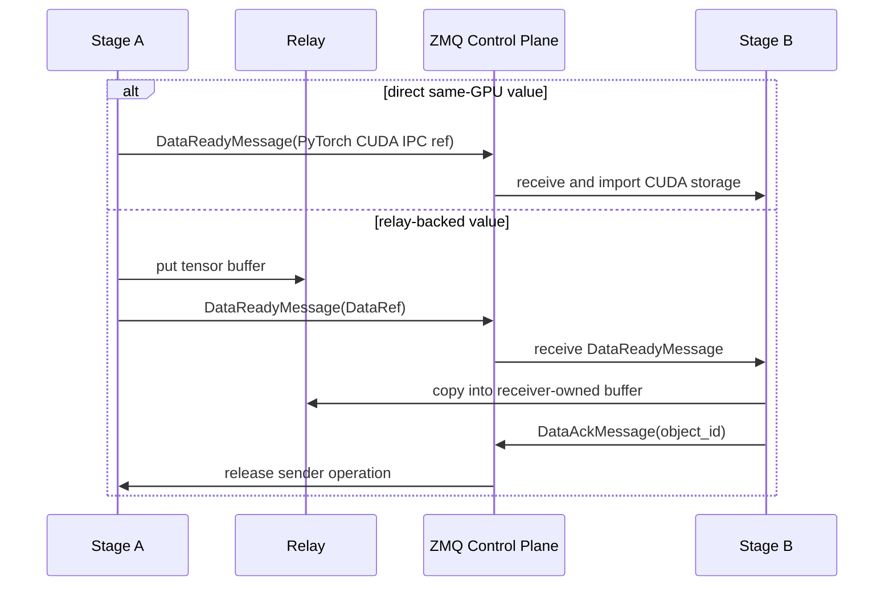

# Communication

For communication among stages in sglang-omni, ZMQ carries small coordination
messages and `sglang_omni.comm` owns the data movement contract. Stage code
routes by stage name. Eligible same-GPU cross-process values use direct PyTorch
CUDA IPC. Other same-node GPU traffic uses the pooled CUDA-IPC relay, local CPU
traffic uses SHM, and configured cross-node movement uses Mooncake.

The main implementation entry points are:


| File                                            | Role                                                                  |
| ------------------------------------------------- | ----------------------------------------------------------------------- |
| `sglang_omni/comm/data_ref.py`                  | Typed `DataRef` carried by `DataReadyMessage.data_ref`                |
| `sglang_omni/comm/router.py`                    | Locality and transport selection                                      |
| `sglang_omni/comm/engine.py`                    | Stage-facing communication facade                                     |
| `sglang_omni/comm/stage_io.py`                  | Payload and stream tensor packing/unpacking                           |
| `sglang_omni/pipeline/control_plane.py`         | ZMQ sockets, msgpack serialization, stage/coordinator message routing |
| `sglang_omni/pipeline/local_dispatch.py`        | Same-process Python object dispatch between colocated stages          |
| `sglang_omni/relay/base.py`                     | Backend interface and backend registry                                |
| `sglang_omni/relay/{cuda_ipc,shm,nccl,nixl,mooncake}.py` | Concrete relay backends                                      |
| `sglang_omni/proto/messages.py`                 | Control-plane message types                                           |

## Transfer Model




| Path                     | Transport      | Carries                                                                                                      |
| ------------------------ | -------------- | ------------------------------------------------------------------------------------------------------------ |
| Coordination             | ZMQ `PUSH/PULL` | `SubmitMessage`, `DataReadyMessage`, `CompleteMessage`, `StreamMessage`, `ShutdownMessage`, profiler control |
| Broadcast coordination   | ZMQ `PUB/SUB`   | `AbortMessage`                                                                                               |
| Same-process movement    | LOCAL_OBJECT   | Full `StagePayload` objects and stream chunks passed by Python reference within one OS process                |
| Same-GPU direct movement | PyTorch CUDA IPC | Eligible payload and stream CUDA storage handles; no relay operation or ACK                                |
| Same-node GPU movement   | CUDA IPC relay | Packed payload tensors, CUDA stream chunks, and stream metadata tensors                                      |
| Local CPU relay movement | SHM relay      | Full payload tensor buffers and stream chunks that are not CUDA-local                                        |
| Cross-node movement      | Mooncake relay | Full payload tensor buffers and stream chunks over Mooncake-selected transport                               |

`DataReadyMessage.data_ref` carries either a direct PyTorch CUDA-IPC dictionary
or a typed relay-backed `DataRef`. A `DataRef` contains an object id, data kind,
transport, layout, backend buffer reference, tensor layout, source device, and
optional stream metadata. Backend-owned details from `RelayOperation.metadata`
live under `DataRef.buffer.info`.

## Normal Payload Flow

The coordinator submits the first `StagePayload` to the entry stage in a
`SubmitMessage`. A same-process edge may subsequently use LOCAL_OBJECT when the
runtime has registered the target in the same OS process and the route is safe
for reference passing.

For a same-GPU cross-process edge, Stage first asks the direct serializer whether
the payload is representable. A direct payload exports its CUDA storages through
PyTorch's multiprocessing reducer and publishes the resulting handles without a
relay operation or `DataAck`. Valid payloads that cannot use the direct format,
including oversized inline headers or received CUDA storage that PyTorch cannot
re-export, continue through the pooled relay path. Unexpected serialization
errors still fail the send.

The pooled payload flow is:

1. `write_payload()` recursively extracts tensors from `payload.data`, replaces
   them with placeholders, records each source device, and concatenates tensors
   into one aligned `uint8` buffer.
2. The sender calls `relay.put_async()` for that buffer and sends a
   `DataReadyMessage(data_ref=...)` containing a `DataRef` with:
   - `buffer.info`: backend-specific metadata from `RelayOperation.metadata`
   - `header`: base64-encoded `StagePayload` without tensors
   - `tensors`: path, shape, dtype, source device, offset, and byte size
3. The receiver handles the message in `Stage._on_data_ready()`, calls
   `CommEngine.read_payload()`, waits for `relay.get_async()`, restores tensors,
   and sends `DataAckMessage` after the receiver-owned copy is safe.
4. The sender completes the pending operation and releases its pool range after
   the ACK.
5. The receiver passes the payload through the stage input handler. If fan-in is
   complete, it enqueues an `IncomingMessage` into
   `scheduler.inbox`.

The payload transfer format is intentionally backend-neutral. Backends only need to
move a flat tensor buffer and return metadata that another backend instance can
use for `get_async()`.

LOCAL_OBJECT bypasses relay and the ZMQ `DataReadyMessage`: the sender calls the
process-local dispatcher, which invokes `receive_local_payload()` on the target
stage with the projected `StagePayload` object itself. This is a direct Python
reference transfer, not serialization. Receivers must treat the payload, nested
data containers, tensors, stream chunks, and metadata as read-only. The object
must also stay valid for the receiver's scheduler queue lifetime; senders and
projection functions must not mutate or recycle objects after dispatch.

For full payloads, LOCAL_OBJECT is allowed for single-target same-process routes.
For fan-out, it is allowed only when each projected payload is a `StagePayload`
with its own `data` container, so downstream stages do not share mutable payload
state. Tensor leaves may still be shared intentionally and must be treated as
read-only.

## Streaming Flow

Streaming is used for producer-consumer edges such as thinker to talker hidden
states or talker to vocoder code tensors. The stage layer exposes one sending
helper, `CommEngine.send_stream_chunk()`, and the router chooses the transport.

For same-GPU cross-process targets:

- runtime prep detects targets whose sender and receiver share the same
  primary GPU
- an eligible CUDA tensor and CUDA-only metadata use a direct PyTorch CUDA-IPC
  dictionary with no relay operation or ACK
- valid envelopes outside the direct representation use the pooled CUDA-IPC
  relay instead, including CPU tensor metadata and large ordinary metadata

For same-process stream targets:

- the stage sends the chunk through `LocalStageDispatcher.send_stream_chunk()`
- the receiver gets the original Python object and metadata by reference
- the same read-only and lifetime caveats as payload LOCAL_OBJECT apply

For nonlocal stream targets:

- the chunk is written with `write_tensor()`
- tensor-valued metadata is extracted and written as separate `DataRef`s
- every raw tensor ref records whether its producer tensor was CPU or CUDA
- the control message is published before the sender waits for receiver ACK
- the receiver copies into private storage, restores CPU leaves to CPU, and
  ACKs the logical envelope
- materialization can overlap across messages, while scheduler visibility waits
  for the predecessor on the same `(request_id, from_stage)` lane

The control-before-ACK-wait ordering is required by credit-based backends. If
the sender waited for receiver completion before publication, the receiver could
not start the copy that releases the sender's credit.

Stream completion and stream errors are control-only messages sent with
`send_stream_signal()`.

## Relay Interface

All backends implement `Relay`:

```python
class Relay:
    async def put_async(
        self,
        tensor: torch.Tensor,
        request_id: str | None = None,
        dst_rank: int | None = None,
        receiver_id: str | None = None,
    ) -> RelayOperation: ...

    async def get_async(
        self, metadata: Any, dest_tensor: torch.Tensor, request_id: str | None = None
    ) -> RelayOperation: ...

    def cleanup(self, request_id: str) -> None: ...
    def close(self) -> None: ...
```

`put_async()` returns a `RelayOperation` whose `metadata` is placed in the
control message. `receiver_id` identifies the process that owns a backend import
lifecycle when the exported resource is consumer-specific. Both put and get
operations expose `await wait_for_completion(timeout=...)`. Stages keep the
operation alive until the transfer is safe to release.

## Transport Selection

There is no public backend selector. `CommRouter` derives the transport from
stage locality and placement:

| Transport | Selection rule |
| --- | --- |
| `local_object` | Source and target stages share one OS process and the payload is eligible for direct local dispatch. |
| Direct PyTorch CUDA IPC | Source and target are different processes on the same placement GPU and the envelope is directly representable. |
| `cuda_ipc` | Source and target are same-node GPU stages and the transfer uses the pooled relay. |
| `shm` | Same-node host/CPU transfer where the selected edge is not GPU-to-GPU. |
| `mooncake` | Cross-node stage edges listed as remote. Mooncake owns protocol selection for those transfers. |

`CommConfig` can tune slot size, credits, and Mooncake connection options per
stage. It does not select a transport backend.

Each backend owns only transport mechanics. It does not route requests, perform
fan-in, choose downstream stages, or interpret model payloads.

## Resource Lifetime

The stage layer follows these ownership rules:

- a direct sender retains exported CUDA storage through PyTorch's IPC lifetime;
  the receiver imports it before use, including when discarding delivered data
  for an aborted request
- a relay sender registers its operations before control publication and starts
  the ACK timeout only after publication succeeds
- the receiver copies into private storage, waits for the get operation, restores
  the payload, and sends one ACK for the logical envelope
- the sender releases pool ranges and retained source tensors after that ACK
- LOCAL_OBJECT has no backend cleanup; sender and receiver share Python object
  references, so correctness depends on read-only use until the receiver is done
- aborts drain data that was already delivered so sender ownership can complete
- stage shutdown calls `relay.close()`

Backend-specific cleanup is hidden behind that interface. For example, `shm`
unlinks blocks after receive, CUDA IPC releases pool slots after ACK, NIXL and
Mooncake release memory-pool credits after completion, and NCCL tears down the
process group on close.
