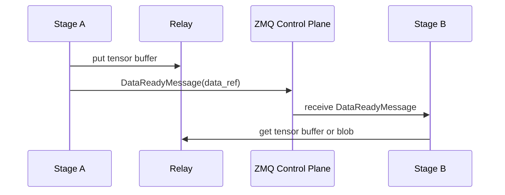

# Communication

For communication among stages in sglang-omni, ZMQ carries small coordination
messages and `sglang_omni.comm` owns the data movement contract. Stage code
routes by stage name; the comm router chooses local object passing, CUDA IPC for
same-node GPU payloads and CUDA stream chunks, SHM for local CPU relay movement,
or Mooncake for configured cross-node movement.

The main implementation entry points are:


| File                                            | Role                                                                  |
| ------------------------------------------------- | ----------------------------------------------------------------------- |
| `sglang_omni/comm/data_ref.py`                  | Typed `DataRef` carried by `DataReadyMessage.data_ref`                |
| `sglang_omni/comm/router.py`                    | Locality and transport selection                                      |
| `sglang_omni/comm/engine.py`                    | Stage-facing communication facade                                     |
| `sglang_omni/comm/stage_io.py`                  | Payload and stream tensor packing/unpacking                           |
| `sglang_omni/pipeline/control_plane.py`         | ZMQ sockets, msgpack serialization, stage/coordinator message routing |
| `sglang_omni/pipeline/local_dispatch.py`        | Same-process Python object dispatch between colocated stages          |
| `sglang_omni/relay/base.py`                     | Backend interface and backend registry                                |
| `sglang_omni/relay/{shm,nccl,nixl,mooncake}.py` | Concrete relay backends                                               |
| `sglang_omni/proto/messages.py`                 | Control-plane message types                                           |

## Transfer Model




| Path                     | Transport      | Carries                                                                                                      |
| ------------------------ | -------------- | ------------------------------------------------------------------------------------------------------------ |
| Coordination             | ZMQ `PUSH/PULL` | `SubmitMessage`, `DataReadyMessage`, `CompleteMessage`, `StreamMessage`, `ShutdownMessage`, profiler control |
| Broadcast coordination   | ZMQ `PUB/SUB`   | `AbortMessage`                                                                                               |
| Same-process movement    | LOCAL_OBJECT   | Full `StagePayload` objects and stream chunks passed by Python reference within one OS process                |
| Same-node GPU movement   | CUDA IPC relay | Full payload tensor buffers, CUDA stream chunks, and stream metadata tensors                                 |
| Local CPU relay movement | SHM relay      | Full payload tensor buffers and stream chunks that are not CUDA-local                                        |
| Cross-node movement      | Mooncake relay | Full payload tensor buffers and stream chunks over Mooncake-selected transport                               |

`DataReadyMessage.data_ref` is the only transfer pointer in the control message.
It contains a typed `DataRef`: object id, data kind, transport, layout, backend
buffer reference, tensor layout, and optional stream metadata. The backend-owned
details from `RelayOperation.metadata` live under `DataRef.buffer.info`.

## Normal Payload Flow

The coordinator submits the first `StagePayload` directly to the entry stage in a
`SubmitMessage`. After that, stage-to-stage payloads normally use relay. A
same-process edge may use LOCAL_OBJECT instead when the runtime has registered
the target in the same OS process and the route is safe for reference passing.

1. The sender asks `CommRouter` for the edge transport and calls
   `CommEngine.write_payload(...)`.
2. `write_payload()` recursively extracts tensors from `payload.data`, replaces
   them with placeholders, pickles the tensor-free `StagePayload`, and
   concatenates tensors into one `uint8` buffer.
3. The sender calls `relay.put_async()` for that buffer and sends a
   `DataReadyMessage(data_ref=...)` containing a `DataRef` with:
   - `buffer.info`: backend-specific metadata from `RelayOperation.metadata`
   - `header`: base64-encoded `StagePayload` without tensors
   - `tensors`: path, shape, dtype, offset, and byte size for each tensor
4. The receiver handles the message in `Stage._on_data_ready()`, calls
   `CommEngine.read_payload()`, waits for `relay.get_async()`, restores tensors,
   and passes the payload through the stage input handler.
5. If fan-in is complete, the stage enqueues an `IncomingMessage` into
   `scheduler.inbox`.

The payload transfer format is intentionally backend-neutral. Backends only need to
move a flat tensor buffer and return metadata that another backend instance can
use for `get_async()`.

LOCAL_OBJECT bypasses relay and the ZMQ `DataReadyMessage`: the sender calls the
process-local dispatcher, which invokes `receive_local_payload()` on the target
stage with the projected `StagePayload` object itself. This is a direct Python
reference transfer, not serialization. Receivers must treat the payload, nested
data containers, tensors, stream chunks, and metadata as read-only. The object
must also stay valid for the receiver's scheduler queue lifetime; senders and
projection functions must not mutate or recycle objects after dispatch.

For full payloads, LOCAL_OBJECT is allowed for single-target same-process routes.
For fan-out, it is allowed only when each projected payload is a `StagePayload`
with its own `data` container, so downstream stages do not share mutable payload
state. Tensor leaves may still be shared intentionally and must be treated as
read-only.

## Streaming Flow

Streaming is used for producer-consumer edges such as thinker to talker hidden
states or talker to vocoder code tensors. The stage layer exposes one sending
helper, `CommEngine.send_stream_chunk()`, and the router chooses the transport.

For same-node GPU targets:

- runtime prep detects targets whose sender and receiver share the same
  primary GPU
- full payload tensor buffers and CUDA tensor stream chunks are written through
  the CUDA IPC relay
- the `DataReadyMessage` carries a `DataRef` with `transport="cuda_ipc"` and a
  `chunk_id` for stream chunks

For same-process stream targets:

- the stage sends the chunk through `LocalStageDispatcher.send_stream_chunk()`
- the receiver gets the original Python object and metadata by reference
- the same read-only and lifetime caveats as payload LOCAL_OBJECT apply

For nonlocal stream targets:

- the chunk is written with `write_tensor()`
- tensor-valued metadata is extracted and written as separate `DataRef`s
- the control message is sent before waiting for pending put operations
- the receiver reads the blob in `Stage._on_stream_chunk()` and enqueues a
  `stream_chunk` message into `scheduler.inbox`

The control-before-wait ordering is important for NIXL and other credit-based
backends. If the sender waited for completion before notifying the receiver, the
receiver would never start the read that releases the sender's credit.

Stream completion and stream errors are control-only messages sent with
`send_stream_signal()`.

## Relay Interface

All backends implement `Relay`:

```python
class Relay:
    async def put_async(
        self, tensor: torch.Tensor, request_id: str | None = None, dst_rank: int | None = None
    ) -> RelayOperation: ...

    async def get_async(
        self, metadata: Any, dest_tensor: torch.Tensor, request_id: str | None = None
    ) -> RelayOperation: ...

    def cleanup(self, request_id: str) -> None: ...
    def close(self) -> None: ...
```

`put_async()` returns a `RelayOperation` whose `metadata` is placed in the
control message. Both put and get operations expose
`await wait_for_completion(timeout=...)`. Stages keep the operation alive until
the transfer is safe to release.

## Transport Selection

There is no public backend selector. `CommRouter` derives the transport from
stage locality and placement:

| Transport | Selection rule |
| --- | --- |
| `local_object` | Source and target stages share one OS process and the payload is eligible for direct local dispatch. |
| `cuda_ipc` | Source and target are same-node GPU stages. CUDA IPC requires CUDA-resident tensors on stream edges. |
| `shm` | Same-node host/CPU transfer where the selected edge is not GPU-to-GPU. |
| `mooncake` | Cross-node stage edges listed as remote. Mooncake owns protocol selection for those transfers. |

`CommConfig` can tune slot size, credits, and Mooncake connection options per
stage. It does not select a transport backend.

Each backend owns only transport mechanics. It does not route requests, perform
fan-in, choose downstream stages, or interpret model payloads.

## Resource Lifetime

The stage layer follows a simple ownership rule:

- sender writes data, sends `DataReadyMessage`, then waits for the put operation
  when required by the backend
- receiver allocates the destination buffer, waits for the get operation,
  restores the payload, and calls `relay.cleanup(request_id)`
- LOCAL_OBJECT has no backend cleanup; sender and receiver share Python object
  references, so correctness depends on read-only use until the receiver is done
- aborts call `relay.cleanup(request_id)` from the stage abort path
- stage shutdown calls `relay.close()`

Backend-specific cleanup is hidden behind that interface. For example, `shm`
unlinks blocks on receive, NIXL and Mooncake release memory-pool credits after
completion, and NCCL tears down the process group on close.
