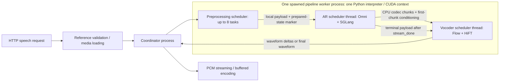

# Architecture and contracts

All source line references in research reports refer to the **baseline**, before the diagnostic patch. Effective runtime settings still require H100 launch evidence. The reports enumerate complete symbol and file coverage; this document connects their ownership boundaries.

## Default execution topology

All three default stages have `process="pipeline"`, TP=1 and one replica. The worker has its asyncio transport loop and stage scheduler threads. Preprocessing's async workers call the synchronous preprocessor in executor threads. AR and vocoder are placed on GPU 0. Prep also reaches GPU speech-tokenizer/embedding work despite having no explicit GPU field. Stage-to-stage edges pass Python object references through `LocalStageDispatcher`; SHM/CUDA IPC are supported infrastructure but are not the default Cosy stage edges. Coordinator terminal/control transport is a separate crossing. Sources: reports [06](reports/06_pipeline_runtime.md), [07](reports/07_serving_transport.md), [13](reports/13_launch_config.md).

The required local edge is prep→AR because prep publishes heavy tensors in a process-global dictionary and admission pops them once. Moving preprocessing alone to another process breaks that contract. Moving only the vocoder is possible as a controlled placement experiment, with different transport/context/memory behavior to measure.

## Conditioning and admission

Public speech validation resolves references before coordinator admission. The model requires one reference clip. With reference text, its speech tokens participate in the LLM prompt; without reference text they remain Flow conditioning but do not join the LLM prompt. Reference encoding has a content/config/model-keyed CPU cache and single-flight deduplication; it is not batched. The cache is bounded at 256 entries / 128 MiB. A cache miss decodes 16 kHz and 24 kHz audio, runs CPU CAMPPlus speaker embedding, the CUDA-preferred ONNX speech tokenizer, and mel extraction/alignment. Each ONNX session's thread limit is clamped against host CPU count, not container quota.

The finalization lock surrounds tokenizer/GPU embedding preparation. The LLM prompt is `[SOS, speaker, text, task, optional prompt speech]`. Every embedding row is copied as float32 to CPU and BLAKE2b-hashed to a 63-bit pseudo-token ID. SGLang radix matching uses these IDs; prefill uses the matching real embedding slices. A new cache key must therefore preserve model/conditioning identity and prefix correctness. It cannot be replaced with arbitrary text IDs. Prepared state and serialized Flow conditioning then enter the AR scheduler. Sources: [01](reports/01_conditioning.md), [04](reports/04_omni_scheduler.md), [05](reports/05_sglang_bridge.md).

## Autoregressive model and reuse

Cosy subclasses SGLang `Qwen2ForCausalLM`, retaining Qwen2 attention/MLP/norm/RoPE and its attention/KV backend. Speech embedding and a plain bias-free 6761-way projection replace the generation endpoints. Actual checkpoint backbone dimensions require the installed weights/config; do not infer them from the 0.5B label.

Omni composes upstream `Scheduler` through bound method delegation, rather than inheriting or running its initializer. It already reuses prefill admission, continuous batching, decode preparation/retraction, `ScheduleBatch`, radix cache, request/KV pools, result processing, sampling/penalties, and decode graphs. Omni owns ingress/build queues, stage output, terminal/abort cleanup, and the custom execution bridge. `NextBatchPlan` contains `batch_to_run` and `running_batch`; Omni updates its running batch from the plan. Sources: [04](reports/04_omni_scheduler.md), [10](reports/10_upstream_scheduler.md).

The default normal loop selects→executes→processes each batch synchronously. Upstream overlap is disabled; Omni's overlap loop raises. Generic Omni async decode is a distinct one-step launch/resolve protocol and is not enabled for Cosy. Default repetition penalty 1.21 and positive min-new-token suppression require committed history, and Cosy collects codec tokens in `post_decode`, not the generic async resolve hook. Enabling an async switch alone is invalid.

Defaults: BF16 AR, maximum 32 running requests, decode graph buckets up to 32, eager custom prefill, `max_prefill_tokens=4096`, static memory fraction 0.85, PyTorch sampling. Operator resolution can override these. AR `.tolist()` materializes sampled IDs in codec collection; later output-processing layers also convert the device tensor unless a host snapshot is supplied. GPU next-token relay uses FutureMap independently of reporting IDs. Control IDs 6561–6760 stop generation after minimum-length suppression; they never become acoustic codec tokens. Sources: [05](reports/05_sglang_bridge.md), [11](reports/11_upstream_execution.md), [14](reports/14_attention_backends.md).

For ordinary non-MLA Qwen2 on SM90 with CUDA >=12.3 and eligible speculative settings, upstream attention resolution selects FA3, with page size 1; explicit backend/config overlays can change this. Published KV dtype stays `auto` until the runner resolves it from model/quantization state. Generic upstream H100 graph capacity defaults do **not** replace Omni's explicit maximum 32 and disabled prefill configuration. The live startup logs remain authoritative. FA3's wrapper defaults to the installed `sgl_kernel.flash_attn` implementation, whose installed binary identity must be recorded. Sources: [15](reports/15_upstream_config.md), [16](reports/16_fa3_backend.md).

The SGLang kernel code is under `python/sglang/kernels`: both JIT operations and the AOT `sglang-kernel` package (`sgl_kernel` import, source version 0.4.6.post1). Existing Qwen kernels already dispatch there or to FlashInfer. Installed wheels are a separate identity check. DiT does not automatically inherit those kernels merely because AR uses SGLang.

## Flow and DiT

The pinned Cosy checkpoint config declares 25 codec tokens/s, two 80-bin mel frames/token, 192-wide input speaker embedding; DiT width 1024, 22 blocks, 16 heads×64, FFN multiplier 2. Sources: [12](reports/12_cosyvoice_internals.md), immutable revisions recorded there.

Buffered Flow packs `[B,max(P+G)]` tokens, prompt mel `[B,max(2P),80]`, and speaker rows. Embedding→three-token pre-lookahead→repeat-by-two produces `mu [B,80,M]`; masks distinguish each row's valid keys. Causal packing handles lookahead at each valid row end. Noise is the fixed CPU-created `[1,80,15000]` prefix, copied, expanded and cloned; requests share that noise realization.

Ten cosine-spaced Euler steps evaluate the estimator on `2B` CFG rows: all conditional rows first, then all unconditional rows. Both halves receive x/mask; only the first half receives mu/cond/speaker. The update is `x += dt * (1.7 * conditional - 0.7 * unconditional)`. Returned mel is float32. Native singleton Flow has the equivalent fixed two-row solver signature. No per-request DiT KV cache exists.

Nonstreaming attention sees all valid keys. Streaming visibility is `key < (floor(query/50)+1)*50`: all earlier chunks plus the entire current 50-mel chunk. It is not token-causal attention. Pinned x-transformers rotates the first 64 channels of `[B,L,1024]` before Cosy reshapes heads; all other head channels remain unchanged. Preserve this observable baseline behavior in any kernel substitution. Adaptive LayerNorm, gates, positional convolutions, masks and padding semantics also differ from Qwen RMSNorm/attention.

Buffered admission counts nominal total mel frames, budget 8000, cap 16, wait 30 ms; a too-large first request runs alone. Adaptive grouping minimizes group count, then padded work and gaps, under a maximum merge gap of 384 and 25% padding budget. Groups execute serially. HiFT groups independently under a maximum padding ratio of 1.5. Neither client concurrency nor admission size proves actual DiT batch size. Sources: [02](reports/02_buffered_acoustics.md).

Existing acceleration switches: `torch.compile` wraps estimator forward only, with startup warmup and eager fallback; TensorRT's estimator has fixed CFG batch 2 and currently executes each request pair separately. The two switches are mutually exclusive. The exported TRT attention mask has different streaming limitations; quality/semantics must be qualified. Neither option is evidence that the entire Euler loop is captured.

## Streaming and HiFT

AR emits its first chunk at 28 generated tokens, then every 25. Omni physically repeats the prompt's final token/mel to a multiple of 25; the official reference instead enlarges the first generated hop. Acoustic hops grow 25→50→100; cumulative readiness is 28, 78, 178, then +100. First hops have priority; follow-up groups match `(hop, token_offset)`. A distinct hardcoded 30 ms peer wait is independent of buffered `max_batch_wait_ms`. Streaming grouping does not apply the buffered 8000-frame admission budget. Sources: [03](reports/03_streaming_acoustics.md).

Multiple eligible rows share packed causal Flow; a singleton uses native Flow. Final catch-up drains ready causal hops, then runs the leftover with `streaming=False, finalize=True`. Each streaming request keeps all generated tokens and all mel history. HiFT runs per request on accumulated mel, then returns the waveform suffix after `speech_offset`.

Causal HiFT predicts F0 in float64, uses constructor-fixed harmonic phase/noise, source STFT, causal upsample/residual convolutions, and ISTFT; the mel-to-wave stride is 480. Its implementation has no evolving request cache. Float64 F0, phase continuity, lookahead, FFT centering, and final cropping are part of the behavior to prove before incremental execution. Buffered HiFT runs once per group; streaming repeatedly recomputes history. Sources: [12](reports/12_cosyvoice_internals.md).

Waveform D2H precedes API encoding. Streaming emits PCM16 deltas; buffered output encodes the whole waveform. Server first-yield markers and client `audio_ttfp_s` measure different boundaries. SeedTTS chunk statistics follow HTTP chunk framing, not model hop boundaries. Abort is observed around scheduler work; it does not interrupt an in-flight Euler/HiFT call. Sources: [07](reports/07_serving_transport.md), [09](reports/09_benchmarks.md).
