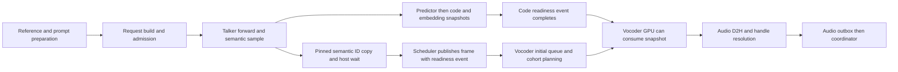

**Qwen3-TTS E4 investigation — 2026-09-12**

E4 is useful evidence against the three attempted mitigations. It does **not** identify the original early-ID regression's exact cause, establish that several independent defects must be fixed, or qualify the nonblocking-copy PR. The most actionable result is a previously unreported first-vocoder interval, together with much slower code-frame production under E4b/E4c. The next experiment should measure that dependency chain on an unchanged control and early-ID candidate, rather than introduce another scheduling policy.

No product code was changed and no local pytest, model, or GPU execution was performed. [analyze_artifacts.py](analyze_artifacts.py) runs only standard-library artifact analysis. [artifact_audit.json](artifact_audit.json) contains the file hashes, per-request event timelines, reconciled benchmark results, log summaries, and calculated statistics. [next_diagnostic.md](next_diagnostic.md) specifies the missing H100 trace.

**Evidence and provenance**

The archive is [qwen3-tts-e4-dc55923e2-20260912.tar.gz](/Users/ratish/sglang-omni/artifacts/qwen3-tts-e4-dc55923e2-20260912.tar.gz). Its 89 tar members contain 74 files totaling 89,142,209 uncompressed bytes; paths and member types were checked before extraction. The extracted evidence is under [results_e4_dc55923e2](/Users/ratish/sglang-omni/artifacts/qwen3-tts-e4-investigation-20260912/results_e4_dc55923e2). All JSONL event files, client timestamps, per-request benchmark JSON/CSV, generated-output manifests, server logs, diffs, and accompanying readouts were inspected or parsed. The original files remain unchanged.

All three arms record product head **04b62c255b7afbfdd20c9faf4f1ffeb44258ea00**, the early-ID branch. `dc55923e2` identifies the analysis/runbook revision. E4a and E4b add their archived uncommitted diffs; E4c changes launch arguments. **No E4 arm contains #2126.** The retained control JSON is byte-identical to the earlier runbook22 pair2 early-ID pass2; it is not a newly measured control. There is no fresh unmodified early-ID boot and no main boot in E4.

The workload is Base 1.7B ad hoc voice cloning, streaming PCM, 1,088 SeedTTS English requests, concurrency 16, warmup 1, and max-new-tokens 2,048. Public seed is unset. Each arm has one server boot and two passes. Server logs resolve max-running 16 and context 8,192; the benchmark JSON's launch-only defaults of 64 are not the running server's limits. The target is H100 GPU 0. The archive reports exclusivity and includes before-run GPU snapshots, but has no continuous CPU/GPU telemetry or complete dependency manifest. Other GPUs were occupied by active tenants. This is a possible shared-host confound, not proof that tenants caused a particular delta.

**What the experiments actually changed**

| Arm | Intervention | Important qualification |
|---|---|---|
| E4a | `sys.setswitchinterval(0.0005)` in `_run_process` | Changes interpreter scheduling for the whole stage process. It does not directly measure GIL ownership or waiting. |
| E4b | Preprocessing context stream gets priority -1; vocoder streams explicitly get -1 | The protocol reports the vocoder already resolved to -1 on this H100. The separate reference-code batcher's stream is still priority 0. |
| E4c | Preprocessing, talker, vocoder in three processes on GPU 0; declared fractions .05/.75/.12 | Changes CUDA contexts, transport, tensor copies, model residency, and stream placement as well as interpreter ownership. |

E4b's changed stream is created in [request_builders.py:181](/Users/ratish/sglang-omni/.worktrees/qwen3-tts-stage-ids-early/sglang_omni/models/qwen3_tts/request_builders.py:181). The reference batcher's independent default-priority stream is created at [request_builders.py:746](/Users/ratish/sglang-omni/.worktrees/qwen3-tts-stage-ids-early/sglang_omni/models/qwen3_tts/request_builders.py:746). Thus the intervention does not uniformly raise all reference preprocessing GPU work. CUDA stream priority is a scheduling hint; it does not guarantee preemption, execution order, or priority for memory transfers. [NVIDIA CUDA guide](https://docs.nvidia.com/cuda/cuda-programming-guide/02-basics/asynchronous-execution.html)

**Recomputed serving outcomes**

All six passes report 1,088 successful requests. Per-request IDs/order agree between benchmark JSON, CSV, and generated manifests; timestamps contain the same requests plus one warmup; audio chunk counts and durations reconcile. Success does not certify audio quality: no audio or codec tensors are in this archive.

| Arm / pass | req/s | TTFC mean / p99, ms | Mean request, s | Mean inter-chunk, ms |
|---|---:|---:|---:|---:|
| Historical early-ID control / 2 | 17.644 | 178.3 / 401.4 | .902 | 89.7 |
| E4a / 1 | 15.851 | 303.7 / 1001.8 | 1.004 | 84.2 |
| E4a / 2 | 17.370 | 190.0 / 420.7 | .915 | 90.2 |
| E4b / 1 | 9.678 | 191.3 / 824.7 | 1.643 | 180.2 |
| E4b / 2 | 9.638 | 158.0 / 384.7 | 1.651 | 184.9 |
| E4c / 1 | 8.427 | 246.2 / 822.8 | 1.890 | 203.9 |
| E4c / 2 | 8.629 | 226.5 / 638.1 | 1.846 | 200.6 |

E4b/E4c are poor replacements in these runs. Their large generation slowdown also appears in unprofiled pass1, so the event recorder cannot be its sole explanation. E4a pass2 is close to the historical early-ID control, with no demonstrated recovery. This is insufficient to establish equivalence or rule out every GIL contribution.

C200 hides smaller playback stalls. Under [playback_continuity.py](/Users/ratish/sglang-omni/.worktrees/qwen3-tts-stage-ids-early/benchmarks/metrics/playback_continuity.py:11), a request passes C200 if its largest computed underrun is at most 200 ms. In pass2, E4a has zero reported positive underruns, E4b has **238/1088** with a maximum of **168 ms**, and E4c has **532/1088** with a maximum of **767.1 ms**. E4b can therefore report C200=100% while many streams have smaller stalls. All first payloads remain 3,840 bytes, or 80 ms of mono 24 kHz PCM16; the first-chunk size did not increase.

There is another 2,048-frame output in E4a pass1: `common_voice_en_19916471-common_voice_en_19916474`, 163.84 seconds of generated audio and 32.0802 seconds request time. It increases that pass's generated work, but is not the last-finishing request. It cannot explain E4b/E4c's repeated slowdown. Preserve/listen to this WAV and retain the resolved seeds/finish reason if available; neither corruption nor harmless sampling variation can be established from its length alone. Only 66–85 of 1,088 output durations per E4 run match the historical control, consistent with the comparison being unseeded and unsuitable for exact numerical qualification.

**The missing streaming interval**

The readout's 12–14 ms `vocoder input to complete` interval is **terminal payload handling**. The vocoder accepts code streams before a full payload. Its generic `stage_input_received` occurs when the talker sends the terminal full-code payload; first audio is already in flight. In the first-180 cohorts below, first audio precedes this terminal input by a median 651 ms, 1,361 ms, and 1,489 ms, respectively. This interval cannot diagnose initial decoding.

The raw events do contain the useful first-audio path. I joined each server UUID across stages, sorted by event timestamp, excluded the first warmup admission, and selected the first **180 admissions per arm**, all of which reached terminal. This controls cohort size and avoids truncated requests. Client dataset IDs and server UUIDs have no explicit mapping in the archive, so this is a common workload-prefix comparison, not a claimed exact UUID-to-client pairing.

Values below are **p50 / p95 milliseconds** within those cohorts. Do not add percentiles.

| Segment | E4a | E4b | E4c |
|---|---:|---:|---:|
| Preprocessing input → complete | 86.5 / 254.2 | 35.7 / 176.0 | 83.5 / 177.3 |
| Preprocessing complete → talker input | .05 / .23 | .06 / .13 | 1.82 / 7.59 |
| Talker input → request-build start | 5.54 / 13.92 | 13.51 / 36.64 | 16.82 / 38.54 |
| Request build | .87 / 1.68 | .52 / 1.25 | 15.01 / 76.74 |
| Build end → scheduler queue | 8.71 / 22.85 | 20.49 / 37.19 | 14.96 / 32.83 |
| Scheduler queue → prefill start | 2.94 / 6.22 | 9.98 / 13.81 | 11.08 / 21.08 |
| Prefill start → first emit | 25.48 / 44.45 | 26.20 / 45.54 | 24.04 / 31.94 |
| First code send → vocoder receipt | .05 / .20 | .08 / .17 | .48 / 8.77 |
| **First code receipt → first audio send** | **74.64 / 174.61** | **25.44 / 91.47** | **33.92 / 104.95** |
| First audio send → coordinator receipt | .20 / .40 | .28 / .52 | .27 / .48 |
| Admission → coordinator first audio | 217.20 / 462.53 | 144.33 / 371.05 | 212.13 / 378.61 |

The cohort means for admission→first-audio are 235.84, 167.74, and 224.77 ms. The means of the consecutive component intervals reconstruct these totals. They describe the early recorded cohort, not full-pass mean client TTFC.

The same cohorts show median numbers of code chunks already received before first audio of **5 / 2 / 1**. Code-send gap medians are **11.08 / 20.33 / 24.23 ms**, and means **15.92 / 29.84 / 32.64 ms**. These are host publication gaps, including prefill interruptions and routing delay; they are not CUDA kernel durations. They nevertheless locate E4b/E4c's slowdown before steady-state audio emission rather than at HTTP delivery. Corresponding prefill-end→model-end medians are 732 / 1,402 / 1,536 ms. Terminal result adaptation is included in `model_path_end`, so this is an AR-side wall interval, not pure decode compute.

Using all complete first-audio paths gives the same direction: vocoder interval medians **70.22 / 24.67 / 31.18 ms** (see audit for exact values). Fixed cohorts are the primary comparison because E4a captured more traffic.

**Recorder coverage and measurement limits**

Raw event counts are 41,571 / 30,605 / 30,599. There are 284 / 216 / 216 admissions and 268 / 200 / 200 terminal responses, including warmup. E4a therefore has 68 additional completions beyond the stated 200 trigger. Sixteen in-flight requests cannot explain that discrepancy; the stop trigger or stop delivery was delayed. The client stop-wrapper source is not present, so the exact reason is unknown. Excluding warmup leaves 281 / 211 / 212 complete first-audio paths. Incomplete timelines must not be treated as completed stage durations.

The event recorder serializes JSON writes under a process lock ([event_recorder.py:186](/Users/ratish/sglang-omni/.worktrees/qwen3-tts-stage-ids-early/sglang_omni/profiler/event_recorder.py:186)). Event-only recording is not zero overhead. E4a pass2's requests completed within the recorded interval average 217.9 ms TTFC, versus 181.1 ms for requests started after recording ends. These are different workload/cache cohorts, so the difference does not measure recorder overhead. It does mean the recorded early window cannot be silently substituted for full-pass steady performance. E4b/E4c remain slow after recording stops.

Stage events are host milestones. `stage_first_stream_chunk_sent` is recorded before delivery, and code receipt precedes validation/ingest/planning. Neither proves the code's CUDA writes have completed. Early IDs intentionally allow publication while the predictor is still running. Moving publication earlier can lengthen “receipt→audio” even without delaying audio in absolute time. This is why a main-versus-candidate GPU-ready timeline is essential.

**Mechanics of the first-audio path**

The early-ID product diff moves `_stage_token_ids` before `code_predictor_forward` and disables an incompatible optional lookahead path. It does not move code/embedding snapshots ahead of predictor execution. [model_runner.py:176](/Users/ratish/sglang-omni/.worktrees/qwen3-tts-stage-ids-early/sglang_omni/models/qwen3_tts/model_runner.py:176), [base.py:122](/Users/ratish/sglang-omni/.worktrees/qwen3-tts-stage-ids-early/sglang_omni/model_runner/base.py:122)

The most specific unmeasured dependency is in initial vocoder planning. `_build_incremental_plan` waits on **the latest** `state.codes_ready`, concatenates **all** retained code chunks, then slices the selected prefix. `_run_initial_batch` plans every admitted state on the same initial stream before launching the first decode cohort; reference-prefixed inputs group by `ref_frames + initial_frames` and cohorts resolve serially. Consequently, a first-audio decode can depend on later received frames and on planning/waits for other requests, even when only one generated frame is selected. [streaming_vocoder.py:1384](/Users/ratish/sglang-omni/.worktrees/qwen3-tts-stage-ids-early/sglang_omni/models/qwen3_tts/streaming_vocoder.py:1384), [initial batch:2221](/Users/ratish/sglang-omni/.worktrees/qwen3-tts-stage-ids-early/sglang_omni/models/qwen3_tts/streaming_vocoder.py:2221)

That dependency is real code behavior and predates these two PRs. **E4 does not establish how many milliseconds it contributed.** It is the first place to correlate producer event completion, initial enqueue/start, selected frames, cohort launch, and audio-copy completion. Removing waits blindly would violate correctness; if the trace proves unnecessary dependencies, a future change must retain readiness and storage ownership for exactly the selected data.

Reference-prefixed first decodes normally miss the cold graph's fresh-frame keys 1/2, because reference frames are included. The snapshots show these expected `uncaptured_fresh_frames` fallbacks in all arms. Warm incremental graphs replay without recorded failures/fallbacks; arena exhaustion and left-context fallback counts are zero. There is no evidence here that the optimization disabled warm graphs or exhausted codec state. Snapshot counters end at different progress points and are not whole-pass denominators.

**Why the GIL conclusion is too strong**

Runbook24 says the scheduler holds the interpreter lock for all step time outside its final CUDA event wait. That is incorrect. PyTorch's generated tensor dispatch releases the GIL ([gen_python_functions.py:1392](/Users/ratish/pytorch/tools/autograd/gen_python_functions.py:1392)), and CUDA graph replay is bound through a no-GIL wrapper ([Graph.cpp:73](/Users/ratish/pytorch/torch/csrc/cuda/Graph.cpp:73)). CUDA event synchronization also releases it. These paths occur inside the predictor and ordinary tensor work.

Subtracting one wait from step wall time therefore cannot measure GIL ownership. A 5 ms switch interval is also not a mandatory wait for every sibling Python operation or a hard delay bound; native code can release the lock earlier and the actual schedule can exceed the nominal interval. [CPython documentation](https://docs.python.org/3/library/sys.html#sys.setswitchinterval)

GIL contention remains a candidate. E4a only says the tested switch-interval change did not recover serving performance. E4c is not an isolated GIL experiment, and the archived CUDA event logs contain no GIL ownership measurements. The statement “the layout difference is the lock” must be withdrawn.

**The split-process path does provably different work**

Standalone preprocessing places four prepared tensors in `Qwen3TTSState`. Their `tensor_cpu` wire codec calls `detach().cpu()` during `to_dict()`. The recorded preprocessing→engine transport is `shm`, as expected for those CPU tensors. Engine request building then issues `.to(device, dtype)` for prompt embeddings, trailing text, reference codes, and pad embeddings, without `non_blocking=True`. [payload_types.py:38](/Users/ratish/sglang-omni/.worktrees/qwen3-tts-stage-ids-early/sglang_omni/models/qwen3_tts/payload_types.py:38), [pipeline_state.py:53](/Users/ratish/sglang-omni/.worktrees/qwen3-tts-stage-ids-early/sglang_omni/scheduling/pipeline_state.py:53), [request_builders.py:1367](/Users/ratish/sglang-omni/.worktrees/qwen3-tts-stage-ids-early/sglang_omni/models/qwen3_tts/request_builders.py:1367)

PyTorch's blocking copy path enqueues the copy then synchronizes the current CUDA stream ([Copy.cu:465](/Users/ratish/pytorch/aten/src/ATen/native/cuda/Copy.cu:465), [CUDAFunctions.h:79](/Users/ratish/pytorch/c10/cuda/CUDAFunctions.h:79)). Thus these small transfers can wait for earlier queued engine work. In-process preprocessing instead hands over existing GPU tensors and adopts their readiness event. This provides a concrete source of additional request-build waits consistent with E4c's 15 ms median, but without per-copy traces it cannot account for all of E4c's throughput loss.

The split also loads additional frontend/tokenizer resources and uses three CUDA contexts. Its KV pool is 544,619 tokens / 58.17 GiB, versus 573,316 / 61.24 GiB in E4a and 572,128 / 61.11 GiB in E4b. All still exceed the logged 131,072-token maximum active request demand. The engine log reports `mem_fraction_static=.850` in every arm; the declared per-stage fractions are not that same setting. No evidence supports diagnosing KV exhaustion here. CUDA context scheduling remains unmeasured; there is no MPS-status record or GPU execution trace that would justify assigning the loss to context switching.

**Cache and workload differences also remain**

| Full pass2 | Uncached prefill tokens | Cached tokens | Prefill batches | Mean rows per prefill |
|---|---:|---:|---:|---:|
| E4a | 24,376 | 49,720 | 710 | 1.53 |
| E4b | 10,777 | 63,319 | 835 | 1.30 |
| E4c | 11,533 | 62,563 | 801 | 1.36 |

Total prompt tokens are exactly 74,096 per pass. E4b/E4c do substantially less uncached prefill work yet generate code more slowly. Their improved preprocessing/first-audio timing does not isolate GPU priority as the sole cause: the closed-loop workload also admits only about half as many requests per second and has different cache and batching history. Equal numbers of concurrent requests do not mean equal shapes, arrival rate, cache hits, or GPU work.

Omni constructs prefix-key IDs from the bytes of actual prepared embedding rows ([request_builders.py:644](/Users/ratish/sglang-omni/.worktrees/qwen3-tts-stage-ids-early/sglang_omni/models/qwen3_tts/request_builders.py:644)); SGLang matches those IDs and the extra key before determining the extend length ([schedule_batch.py:1390](/Users/ratish/sglang/python/sglang/srt/managers/schedule_batch.py:1390)). Aggregate hit counts cannot distinguish different prepared embeddings, admission order, or cache history. Recording existing CPU key IDs/digests and prefix lengths resolves this without adding GPU synchronization.

The non-streaming census cited by runbook24 was verified directly in the older compact archive: both `A/census_valid/census_c16/bench/speed_results.json` and `B/census/census_c16/bench/speed_results.json` have `stream=false`, `response_format=wav`, and 192 requests. Its whole-utterance vocoder durations are valid measurements for that path, but are not measurements of streaming bootstrap. Similarly, old same-head boot variation is not a statistical equivalence threshold that proves #2126's +10.9 ms TTFC difference immaterial.

**Decision for both PRs**

The two optimizations remove real host waits, while preserving the inspected ordering and buffer-lifetime contracts. Performance acceptance is still an end-to-end question. E4 exposes scheduling tradeoffs and an initial-audio critical path; it does not show that unrelated kernels must all be optimized before these PRs can work.

For #2123, obtain a fresh common-base control and early-ID trace of the complete streaming path. For #2126, retain the existing structural correctness assessment but do not use E4 to claim performance or numerical coverage: that code was not exercised. Once #2123's dependency is identified, trace the combined stack at the same boundary, including sampling-buffer restaging and terminal-result outbox waits.

The highest-value next observation is: **for a delayed first chunk, when were its required codes actually ready, when did the initial worker submit the decode, when did GPU execution begin/end, and when did completed audio leave the outbox?** The exact missing measurements and evidence-to-fix decision table are in [next_diagnostic.md](next_diagnostic.md).
